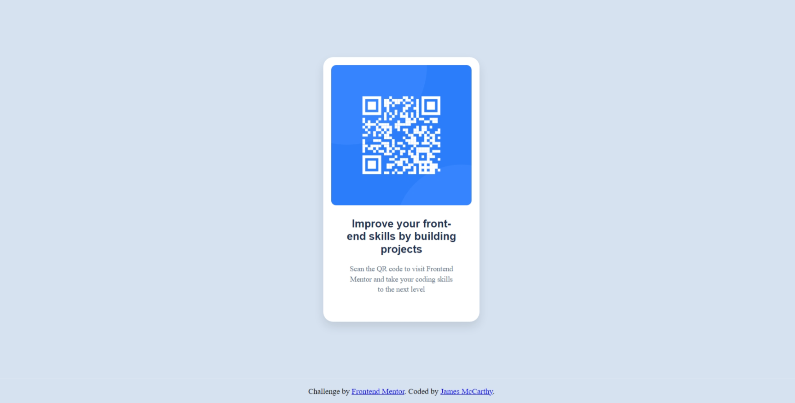

# Frontend Mentor - QR code component solution

This is a solution to the [QR code component challenge on Frontend Mentor](https://www.frontendmentor.io/challenges/qr-code-component-iux_sIO_H). Frontend Mentor challenges help you improve your coding skills by building realistic projects. 

## Table of contents

- [Frontend Mentor - QR code component solution](#frontend-mentor---qr-code-component-solution)
  - [Table of contents](#table-of-contents)
  - [Overview](#overview)
    - [Screenshot](#screenshot)
    - [Links](#links)
  - [My process](#my-process)
    - [Built with](#built-with)
    - [What I learned](#what-i-learned)

## Overview

A responsive QR code component that adapts to different screen sizes while maintaining visual consistency and proper layout.

### Screenshot

### Links

- Solution URL: [https://github.com/syndicate2024](https://github.com/syndicate2024/qr)
- Live Site URL: [https://syndicate2024.github.io/qr/](https://syndicate2024.github.io/qr/)

## My process

### Built with

- Semantic HTML5 markup
- CSS custom properties
- Flexbox
- Mobile-first workflow
- Responsive design principles
- CSS Media Queries

### What I learned

- How to implement responsive design using media queries
- Working with CSS custom properties (variables)
- Managing breakpoints for different screen sizes
- Implementing hover effects
- Using Flexbox for centering and layout

Key code snippets:
